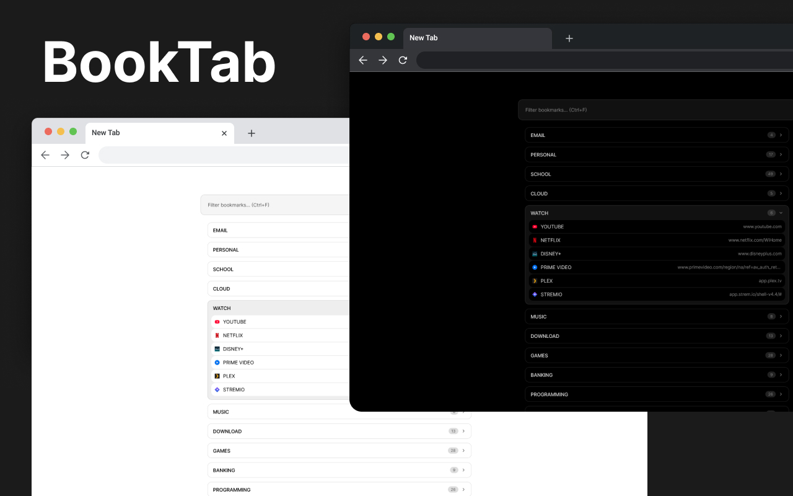

<p align="center">
  
</p>

<h1 align="center">BookTab</h1>

<p align="center">
  <strong>A minimal, high-performance new tab extension for Firefox and Chrome.</strong><br>
  Replace your default new tab with a clean, searchable list of all your bookmarks.
</p>

<p align="center">
  <a href="https://addons.mozilla.org/en-US/firefox/addon/booktab/"><b>Firefox Add-ons</b></a> •
  <a href="https://chrome.google.com/webstore/detail/booktab/"><b>Chrome Web Store</b></a>
</p>

---



## Features

- 🔍 **Instant Search** — Filter bookmarks by title or URL as you type. 
- 📂 **Collapsible Folders** — Browse your hierarchy with ease. Folders auto-expand on search matches.
- 🌓 **Dark Mode** — Dark and light themes with automatic system synchronization.
- 🛡️ **Privacy First** — No tracking, no external ads, just your bookmarks.

## Installation

### Stores
- [**Install for Firefox**](https://addons.mozilla.org/en-US/firefox/addon/booktab/)
- **Install for Chrome** (coming soon)

### Build from Source

1. Clone the repository:
   ```bash
   git clone https://github.com/alecdotdev/booktab.git
   cd booktab
   ```
2. Install dependencies and build:
   ```bash
   npm install
   npm run build
   ```
3. Load the `dist` folder as an unpacked extension in your browser.

## Built With

- [Svelte](https://svelte.dev/)
- [Vite](https://vitejs.dev/)
